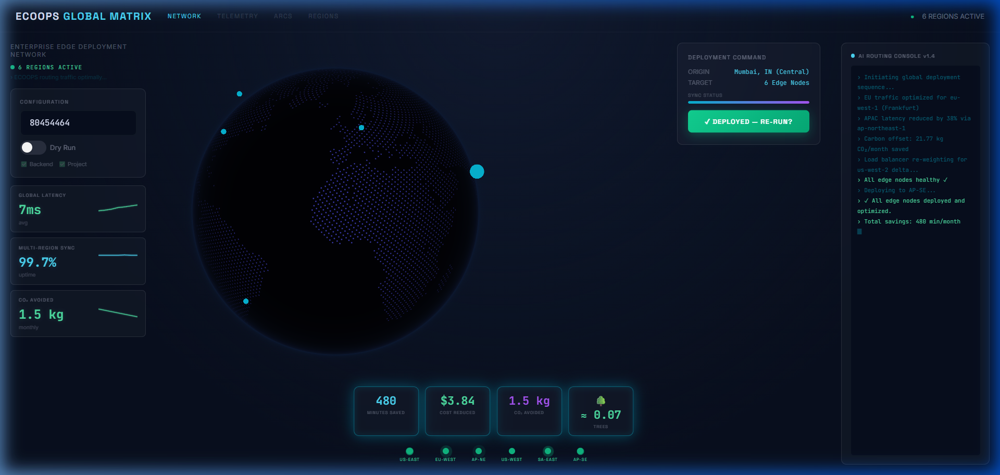
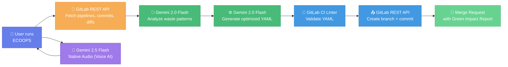

# ECOOPS 🌱

### Emission Cost Optimizer — Operations Pipeline System

> **Making CI/CD sustainable, one pipeline at a time.**

[](https://gitlab.com)
[](https://ai.google.dev/)
[](https://ai.google.dev/)
[](LICENSE)
[](docs/green-impact-methodology.md)

---

## 🚨 The Problem

**CI pipelines waste enormous compute running jobs on commits where they provide zero value.**

Consider a typical project:
- A **Python linter** runs on every commit — even when only `README.md` changed
- A **build job** recompiles the entire app — even when only `docs/` were updated
- A **test suite** executes every test — even when only infrastructure configs changed

This waste translates directly to:
- 💰 **Wasted money** on CI runner minutes
- ⚡ **Wasted energy** powering unnecessary compute
- 🌍 **Unnecessary CO₂ emissions** contributing to climate change

> The average engineering team wastes **30–40% of CI minutes** on jobs that could have been skipped.

---

## 💡 The Solution

**ECOOPS** is an AI-powered tool that uses **Google Gemini 2.0** and the **GitLab REST API** to:

1. **Analyze** your pipeline history and commit diffs to find wasted compute
2. **Optimize** your `.gitlab-ci.yml` with smart `rules:changes:` blocks
3. **Report** the environmental and cost savings in a Green Impact Report
4. **Create** a Merge Request with the optimized config + full impact analysis

It comes with two interfaces:
- **🌐 Global Matrix Dashboard** — An immersive React + WebGL (Cobe) experience with a 3D holographic globe, 4 interactive views (Network, Telemetry, Arcs, Regions), and **real-time voice AI** powered by Gemini 2.5 Flash Native Audio.
- **⌨️ CLI** — Single-command analysis for CI integration

### Key Features
- **🎤 Voice AI Assistant** — Talk to ECOOPS using natural voice via Gemini 2.5 Flash Native Audio with always-on listening and barge-in support
- **💬 Chat Interface** — Text-based chat with the ECOOPS AI assistant
- **🌍 Interactive Navigation** — 4 views: Network (globe), Telemetry (metrics), Arcs (optimization flow), Regions (edge nodes)
- **📊 Real-time Analysis** — SSE-powered live progress updates during pipeline analysis

### Global Matrix 3D Dashboard



---

## 🏗️ Architecture



### How It Works

| Step | Component | Action |
|------|-----------|--------|
| **1** | GitLab API | Fetch 50+ commits with diffs, read `.gitlab-ci.yml`, map repo structure |
| **2** | Gemini AI | Analyze which jobs depend on which files, identify wasted runs |
| **3** | Gemini AI | Generate optimized YAML with `rules:changes:` blocks |
| **4** | GitLab API | Validate optimized YAML with CI Linter |
| **5** | GitLab API | Create branch `ecoops/optimize-pipeline`, commit changes |
| **6** | GitLab API | Open MR with Green Impact Report (CO₂, cost, energy savings) |

---

## 🚀 Quick Start

### Prerequisites

- Python 3.9+
- Node.js 18+ (for 3D dashboard)
- A GitLab project with CI/CD history (10+ commits recommended)
- GitLab Personal Access Token (with `api` scope)
- Google Gemini API key ([get one free](https://aistudio.google.com/apikey))

### Setup

```bash
# Clone the repository
git clone https://gitlab.com/sungodnikaa69-group/ecoops.git
cd ecoops

# Install Python dependencies
pip install -r requirements.txt

# Configure API keys
cp .env.example .env
# Edit .env with your GITLAB_TOKEN, GEMINI_API_KEY, and GITLAB_PROJECT_ID
```

### Run — CLI

```bash
# Full optimization (creates branch + MR)
python -m backend.ecoops --project-id YOUR_PROJECT_ID

# Dry run (analyze only, no changes)
python -m backend.ecoops --project-id YOUR_PROJECT_ID --dry-run

# JSON output for CI integration
python -m backend.ecoops --project-id YOUR_PROJECT_ID --json
```

### Run — Global Matrix 3D Dashboard

```bash
# Start the Flask backend
flask --app backend.web_app run --port 5001

# In a new terminal — start the 3D frontend
cd frontend
npm install
npm run dev
# Visit http://localhost:5173
# Input your GitLab Project ID and click 'LAUNCH 🚀'
# Use the navigation tabs (NETWORK, TELEMETRY, ARCS, REGIONS) to explore views
# Click the 🎤 mic button to talk to the ECOOPS Voice AI
# Click the 💬 chat icon to open the text chat
```

### ☁️ Live Cloud Deployment
ECOOPS is deployed globally on Google Cloud Run:
**[https://ecoops-ei3qr7hppq-uc.a.run.app](https://ecoops-ei3qr7hppq-uc.a.run.app)**

### Run — 2D Web Dashboard

```bash
# Start the Flask app (includes built-in dashboard)
flask --app backend.web_app run --port 5001
# Visit http://localhost:5001
```

### Environment Variables

```env
GITLAB_TOKEN=glpat-xxx           # GitLab Personal Access Token (api scope)
GEMINI_API_KEY=xxx               # Google Gemini API key
GITLAB_PROJECT_ID=80425527       # Target project ID
GITLAB_BASE_URL=https://gitlab.com  # GitLab instance URL (optional)
```

---

## 📊 Sample Green Impact Report

> From analyzing a real project with 50 pipeline runs:

| Metric | Before | After (Projected) |
|--------|--------|-------------------|
| CI Minutes/Month | 4,200 | 2,520 |
| Monthly Cost | $33.60 | $20.16 |
| Energy Usage | 35.0 kWh | 21.0 kWh |
| CO₂ Emissions | 13.5 kg | 8.1 kg |

### 💰 Monthly Savings
- **⏱️ 1,680 minutes** of CI compute saved
- **💵 $13.44** in runner costs avoided
- **⚡ 14.0 kWh** of energy saved
- **🌍 5.4 kg CO₂** of emissions avoided
- **🌳 Equivalent to 0.25 trees absorbing CO₂ for a month**

---

## 🎯 Technical Deep Dive

### Step 1: Data Collection (GitLab REST API)

ECOOPS fetches rich data from your GitLab project:

```
GET /api/v4/projects/:id/repository/commits?per_page=50
GET /api/v4/projects/:id/repository/commits/:sha/diff
GET /api/v4/projects/:id/repository/files/.gitlab-ci.yml
GET /api/v4/projects/:id/repository/tree?recursive=true
```

It cross-references:
- Which **files changed** in each commit
- What **jobs exist** in your CI configuration
- What **files each job actually depends on** (inferred from script commands and artifact patterns)

### Step 2: AI Waste Analysis (Gemini 2.0)

The commit history, CI config, and repo structure are sent to Gemini with a structured prompt that produces:
- Per-job dependency mapping (file globs)
- Wasted run counts and percentages
- Estimated duration and monthly waste

### Step 3: YAML Optimization (Gemini 2.0)

The optimizer takes the waste analysis + current YAML and adds `rules:changes:` blocks:

```yaml
# Before (runs on EVERY commit):
lint:
  stage: test
  script:
    - flake8 src/

# After (ECOOPS optimized — only runs when Python files change):
# ECOOPS: Added rules:changes to reduce waste
lint:
  stage: test
  script:
    - flake8 src/
  rules:
    - changes:
        - "src/**/*.py"
        - "tests/**/*.py"
        - ".flake8"
        - ".gitlab-ci.yml"
```

### Step 4: Validation & MR Creation

- The optimized YAML is validated with the GitLab CI Linter API
- A new branch `ecoops/optimize-pipeline` is created
- A Merge Request is opened with the full **Green Impact Report**

---

## 🌿 Green Impact Methodology

Our CO₂ calculations use industry-standard conversion factors:

| Factor | Value | Source |
|--------|-------|--------|
| CI Runner Cost | $0.008/minute | GitLab SaaS medium runner pricing |
| Server Power | 0.5 kWh/hour | Average cloud compute instance |
| Grid Carbon Intensity | 0.385 kg CO₂/kWh | IEA Global Average (2024) |
| Tree CO₂ Absorption | 21.77 kg CO₂/month | EPA estimate (261.27 kg/year ÷ 12) |

See [full methodology documentation](docs/green-impact-methodology.md) for details.

---

## 📁 Repository Structure

```
ecoops/
├── backend/                        # Python backend
│   ├── ecoops.py                   # CLI entrypoint (orchestrator)
│   ├── web_app.py                  # Flask web dashboard + API
│   ├── config.py                   # Configuration constants
│   ├── services/
│   │   ├── gemini_client.py        # Google Gemini AI client
│   │   └── reporter.py            # Green Impact Report generator
│   └── utils/
│       ├── gitlab_client.py        # GitLab REST API v4 client
│       ├── run_logger.py           # Analysis run logger
│       └── shared_utils.py         # Shared utility functions
│
├── frontend/                       # 3D React/Three.js dashboard
│   ├── src/
│   │   ├── main.tsx                # Theme provider entrypoint
│   │   ├── App.tsx                 # Legacy dark theme component
│   │   ├── globalmatrix/           # UI 4: Global Matrix (Active)
│   │   │   └── GlobalMatrixApp.tsx # WebGL Globe, Tabs & Edge simulation
│   │   ├── voice/                  # Voice AI integration
│   │   │   └── VoiceAgent.ts       # Gemini 2.5 Flash Native Audio client
│   │   ├── components/             # Shared UI components
│   │   │   ├── VoiceMicButton.tsx  # Floating mic button with states
│   │   │   ├── ChatBox.tsx         # Collapsible chat panel
│   │   │   └── ErrorBoundary.tsx   # React error boundary
│   │   ├── solarpunk/              # UI 2: Clean-tech light theme
│   │   ├── telemetry/              # UI 3: Aether Control metrics
│   │   └── index.css               # Global styles
│   ├── public/
│   │   └── pcm-worklet.js          # AudioWorklet for 16kHz PCM capture
│   └── package.json                # Node.js dependencies
│
├── templates/
│   ├── web/dashboard.html          # 2D web dashboard template
│   └── green-impact-report.md      # Report template
├── static/                         # CSS + JS for 2D dashboard
│
├── tests/                          # Unit tests
│   ├── test_gitlab_client.py
│   ├── test_gemini_client.py
│   ├── test_reporter.py
│   ├── test_run_logger.py
│   └── test_api.py
│
├── .gitlab/                        # GitLab Duo AI configurations
│   ├── agents/                     # Custom agent system prompts
│   │   ├── pipeline-analyzer.md
│   │   ├── yaml-optimizer.md
│   │   └── green-impact-reporter.md
│   └── flows/                      # Agent flow definitions
│       └── ecoops-flow.yml
├── demo/
│   ├── wasteful-ci.yml             # Intentionally wasteful CI (for demo)
│   └── sample-app/                 # Sample Python app
├── docs/
│   ├── green-impact-methodology.md # Impact calculation methodology
│   └── agent-setup-guide.md        # Setup documentation
├── logs/                           # Analysis run logs (auto-generated)
│
├── .gitlab-ci.yml                  # Project CI/CD configuration
├── requirements.txt                # Python dependencies
├── .env.example                    # Environment variable template
├── AGENTS.md                       # Agent guidelines
├── LICENSE                         # MIT License
└── README.md
```

---

## 🧪 Testing

```bash
# Run all tests
pytest tests/ -v

# Run with coverage
pytest tests/ -v --cov=backend --cov-report=html
```

---

## 🤝 Contributing

1. Fork the repository
2. Create a feature branch: `git checkout -b feature/amazing-feature`
3. Commit your changes: `git commit -m 'Add amazing feature'`
4. Push to the branch: `git push origin feature/amazing-feature`
5. Open a Merge Request

---

## 📄 License

This project is licensed under the MIT License — see the [LICENSE](LICENSE) file for details.

---

<p align="center">
  <strong>🌱 ECOOPS</strong><br/>
  <em>Emission Cost Optimizer — Operations Pipeline System</em><br/>
  <em>Making CI/CD sustainable, one pipeline at a time.</em>
</p>
